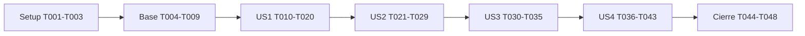

# Tasks: Login local y sesiones persistentes

**Input**: [spec.md](spec.md), [plan.md](plan.md), [research.md](research.md), [data-model.md](data-model.md), [contrato](contracts/browser-auth.md), [quickstart.md](quickstart.md).
**Estado**: 56 tareas realizadas; resultados y límites en [completion-evidence.md](completion-evidence.md) y [composition-review.md](composition-review.md).
**Tests**: obligatorios por FR-020 y SC-001–007. Escribir casos y confirmar fallo antes de modificar comportamiento; tests de contrato/browser reales además de unitarios.
**Formato**: IDs secuenciales; [P] sólo archivos independientes de tareas de su mismo grupo; [USn] identifica historia. Las rutas nuevas son destinos previstos. No commit/push/deploy sobre instalación viva sin solicitud explícita.

## Phase 1: Setup

- [x] T001 Inspeccionar git status, releer AI_WORKFLOW.md secciones 3–7/11, consultar impacto Graphify y contrastar puntos auth/Work/canales con fuente; registrar decisiones TDD y límites del entorno en specs/004-browser-login-sessions/implementation-status.md.
- [x] T002 Configurar @playwright/test, script test:e2e y puertos/contextos privados en web/package.json, web/package-lock.json y web/playwright.config.ts; reutilizar toolchain existente sin alterar runtime ni publicar.
- [x] T003 [P] Preparar fixture descartable de FastAPI/JWKS personal/SQLite real y reloj interno inyectable con procesos supervisados en test/fixtures/browser_auth_runtime.py, sin endpoint de control de reloj en producción.

**Checkpoint**: runner/fixture disponibles; no prueba health como sustituto de petición protegida. T002/T003 independientes tras T001.

## Phase 2: Foundational

- [x] T004 Añadir pruebas de schema, permisos, identidad/epoch, reloj, locks y atomicidad en test/clients/test_browser_auth_repository.py y de validación de políticas en test/services/test_browser_auth.py antes de persistencia.
- [x] T005 [P] Definir cuenta/sesión/política/errores y puerto de identidad en src/cli_agent_orchestrator/models/browser_auth.py sin dependencias de infraestructura, según data-model.md.
- [x] T006 Implementar SQLite propia versionada, creación privada, WAL/foreign_keys/busy_timeout, transacciones de versión/epoch, límites y purga en src/cli_agent_orchestrator/clients/browser_auth_repository.py; ejecutar T004 contra disco real.
- [x] T007 Añadir regresiones de resolución bearer/cookie y precedencia sin fallback para Authorization inválido en test/security/test_auth.py y test/api/test_browser_auth.py; cubrir Principal sellado y prohibición de elección de owner/scopes.
- [x] T008 Ampliar factoría sellada/puerto de resolución en src/cli_agent_orchestrator/security/auth.py conservando tupla jwt y scopes del operador, sin imports clients/database/tmux ni cambio del modo tradicional.
- [x] T009 Definir configuración opt-in, validación de binding/origen y composición fail-closed del servicio en src/cli_agent_orchestrator/services/browser_auth.py y src/cli_agent_orchestrator/api/main.py; configuración habilitada inválida impide ofrecer acceso anónimo.

**Checkpoint**: T004–T009 bloquean historias. No nueva identidad, cambio de Work schema ni login web habilitado automáticamente. T004/T005 tienen archivos distintos y pueden prepararse juntos; T006 depende de ambos. T007 precede T008; T009 depende de T006/T008.

## Phase 3: US1 — Cuenta local y login (P1, MVP)

**Independent Test**: crear cuenta en fixture sin usuario previo, abrir bundle construido limpio, rechazar credenciales incorrectas con mensaje equivalente y entrar al dashboard con identidad y permisos anteriores en <30 s.

- [x] T010 [P] [US1] Probar hashes, Unicode/límites, dummy hash de usuario inexistente y capacidad scrypt en test/security/test_browser_passwords.py; comprobar fallos antes de implementar.
- [x] T011 [P] [US1] Probar alta local/getpass/propietario, no defaults ni sobrescritura y fallo de habilitación sin duplicar cuenta en test/scripts/test_personal_deployment.py.
- [x] T012 [P] [US1] Probar contrato login/config/session, cuerpos limitados, errores 422 sin secretos, Origin/otro puerto, precedencia y rate limit concurrente en test/api/test_browser_auth.py.
- [x] T013 [P] [US1] Probar UI inicial, password manager, recordar sin preselección y gating de datos en web/src/test/browser-login.test.tsx; extender modo local vs bearer en web/src/test/browser-auth.test.ts.
- [x] T014 [US1] Implementar scrypt versionado de R2, salt aleatoria/compare_digest, dummy hash, máximo dos verificadores y cola acotada en src/cli_agent_orchestrator/security/browser_passwords.py; benchmark local sin debilitar parámetros.
- [x] T015 [US1] Implementar alta y login transaccionales, contadores cuenta/IP 10/300 s con espera 60 s, revalidación tras hash y auditoría sin secretos en src/cli_agent_orchestrator/services/browser_auth.py y src/cli_agent_orchestrator/clients/browser_auth_repository.py.
- [x] T016 [US1] Implementar /auth/config, /auth/login y /auth/session, cookie privada temporal/recordada, guardias exactas y redacción de validación/body en src/cli_agent_orchestrator/api/browser_auth_routes.py; registrar router en src/cli_agent_orchestrator/api/main.py.
- [x] T017 [US1] Añadir account-create con binding de operador verificado, política opt-in y URL limpia del comando web en scripts/personal_deployment.py; pasar configuración validada al servicio sin contraseñas argv/env.
- [x] T018 [US1] Añadir BrowserLogin y montaje sólo tras auth/session en web/src/components/BrowserLogin.tsx y web/src/App.tsx; adaptar web/src/auth.ts/web/src/components/BrowserConnection.tsx para distinguir local_password del bearer tradicional y eliminar almacenamiento bearer histórico en modo local.
- [x] T019 [US1] Integrar cookies/origen/BASE y proxy /auth de desarrollo explícito en web/src/api.ts y web/vite.config.ts; requests con redirect=error, credenciales same-origin y errores diferenciados.
- [x] T020 [US1] Añadir y ejecutar aceptación de alta/login/usuario falso/cookies bloqueadas/secrets en web/e2e/browser-login.spec.ts contra bundle construido y servidor real; registrar SC-001 y casos rechazados en specs/004-browser-login-sessions/completion-evidence.md.

**Checkpoint**: US1 completo para demo local, no feature completa. T010–T013 preparables en paralelo tras base; implementaciones después de sus pruebas. T017 depende de servicio/config; T020 depende de toda la integración US1. Las cookies bloqueadas muestran explicación; no fallback con secreto JS.

## Phase 4: US2 — Continuidad y renovación (P1)

**Independent Test**: recordada atraviesa tres leases/8 h, dos pestañas, reload y reinicio servidor/navegador sin nuevo password; temporal recarga y termina sin persistencia explícita; escritura incierta no se repite.

- [x] T021 [P] [US2] Probar renovación concurrente sin Set-Cookie, lease vs idle/absolute, actividad útil vs polling, reloj/sleep/restart y DB ocupada en test/services/test_browser_auth.py y test/clients/test_browser_auth_repository.py.
- [x] T022 [P] [US2] Probar generaciones, red/503, 401 antiguo tras login nuevo, un solo retry GET y cero replay POST en web/src/test/browser-auth.test.ts y web/src/test/api.test.ts.
- [x] T023 [P] [US2] Añadir contratos cookie y supervisión WS/workflow-SSE/AG-UI/MCP Apps con rechazo de origen/scopes y sin tokens URL en test/api/test_browser_channel_auth.py.
- [x] T024 [US2] Implementar renovación de lease sin actualizar cookie/idle ni ampliar límites, high-water persistido y clasificación de actividad fijada por servidor en src/cli_agent_orchestrator/services/browser_auth.py y src/cli_agent_orchestrator/clients/browser_auth_repository.py.
- [x] T025 [US2] Implementar POST /auth/renew y lease-expired distinguible sin cambiar envelopes Work en src/cli_agent_orchestrator/api/browser_auth_routes.py y src/cli_agent_orchestrator/api/main.py; adaptar get_work_launch_principal y verificadores directos al puerto común.
- [x] T026 [US2] Implementar monitor de canales <=2 s, chequeo antes de emitir/input, metadata de sesión y cookie auth en terminal_ws, streams workflow/AG-UI/MCP Apps de src/cli_agent_orchestrator/api/main.py; preservar bearer nativo y permisos.
- [x] T027 [US2] Implementar máquina de estados y generaciones, renovación preventiva/autónoma mientras sesión vigente, coordinación de pestañas sin secretos y conservación ante red/503 en web/src/auth.ts; repetir sólo GET/HEAD una vez tras access_renewal_required.
- [x] T028 [US2] Quitar query token del WS local, reconectar sólo transporte y mantener cursores SSE sin replay de inputs/launches en web/src/api.ts, web/src/components/TerminalView.tsx y web/src/components/workflow/useEventFollow.ts; mostrar incertidumbre en operaciones afectadas con consulta de recibo/estado.
- [x] T029 [US2] Ejecutar perfiles reales persistentes y temporales, browser restart/restore ventanas, servidor restart, tres renovaciones/8 h, dos pestañas y respuestas demoradas en web/e2e/browser-login.spec.ts; registrar SC-002/003/005 y conservar contadores/recibos.

**Checkpoint**: US2 depende de US1. Pruebas T021–T023 independientes en paralelo; T024–T028 secuenciales donde comparten archivos. Supervisión no depende de tráfico ni de broadcasts; lease vencido requiere renovación y reconexión sin nueva escritura.

## Phase 5: US3 — Logout y revocación (P2)

**Independent Test**: dos contextos browser, logout actual no revoca el otro; logout-all revoca ambos; nueva acción denegada y canales retirados <=5 s, sin cancelar agentes.

- [x] T030 [P] [US3] Probar carreras renew/logout/login/password_version, logout repetido y all con DB real en test/services/test_browser_auth.py; comprobar revocación tras commit y cookie no borrada por respuesta antigua.
- [x] T031 [P] [US3] Probar revocación inmediata de nuevas escrituras, WS input y emisiones SSE; medir silencio/tráfico y almacenamiento caído en test/api/test_browser_channel_auth.py.
- [x] T032 [P] [US3] Probar UI logout/all, generación y cierre pendiente offline en web/src/test/browser-account.test.tsx sin afirmar revocación no confirmada.
- [x] T033 [US3] Implementar logout actual/all con epoch/version y auditoría atómicos, idempotencia sin borrar cookie y rechazo de sesión revocada en src/cli_agent_orchestrator/services/browser_auth.py, src/cli_agent_orchestrator/clients/browser_auth_repository.py y src/cli_agent_orchestrator/api/browser_auth_routes.py.
- [x] T034 [US3] Añadir controles logout/all y límites en web/src/components/BrowserAccount.tsx y web/src/App.tsx; abortar vistas/streams y confirmar revocación desde web/src/auth.ts sin interpretar avisos viejos como logout de sesión nueva.
- [x] T035 [US3] Ejecutar logout/all con múltiples pestañas/contextos, input real y SSE abiertos, respuesta renew/logout retrasada tras login nuevo en web/e2e/browser-login.spec.ts; medir <=5 s y comprobar Work durable sin cambios en specs/004-browser-login-sessions/completion-evidence.md.

**Checkpoint**: US3 depende de US1 y del monitor US2. T030–T032 independientes; T033/T034 tras sus casos, T035 tras integración. Trabajo admitido antes de revocación puede finalizar; ningún efecto nuevo después del commit.

## Phase 6: US4 — Recuperación y compatibilidad (P2)

**Independent Test**: cambio/reset rechaza contraseña anterior y revoca previas, restore exige login y mantiene cuenta/tupla/Work; clientes bearer autorizados mantienen sus límites.

- [x] T036 [P] [US4] Probar password actual/new, reset concurrente a login, account-disable y fallo de restore antes de publicar en test/services/test_browser_auth.py y test/scripts/test_personal_deployment.py; snapshot SQLite y config privados reales.
- [x] T037 [P] [US4] Probar cookie vs JWT con provisiones/grants/recibos previos, tupla incluida kind, GET/write/launch/knowledge y scopes limitados en test/integration/test_browser_auth_work_compatibility.py y regresiones API/Work existentes; verificar default-off/IdP externo sin ampliación de autoridad.
- [x] T038 [P] [US4] Probar contrato y formulario cambio password sin mostrar secretos, pérdida de sesiones tras cambio y vuelta a login en test/api/test_browser_auth.py y web/src/test/browser-account.test.tsx.
- [x] T039 [US4] Implementar cambio password con comprobación actual, rate limit, hash fuera de lock y account_version/revocación atómicos en src/cli_agent_orchestrator/services/browser_auth.py y src/cli_agent_orchestrator/api/browser_auth_routes.py; no login implícito.
- [x] T040 [US4] Añadir account-reset/disable con propietario OS/getpass, recuperación activa independiente del throttle y habilitación reversible en scripts/personal_deployment.py; preservar issuer/sub/clave/credenciales máquina.
- [x] T041 [US4] Adaptar backup/restore a invalidación browser en staging antes de publish, integridad/epoch/auditoría, client.env con ruta final (no staging) y fallo sin destino usable en scripts/personal_deployment.py; comprobar contextos de identidad de Work existentes sin rediseñar recuperación portable.
- [x] T042 [US4] Añadir cambio password con autocomplete apropiado y revocación UI en web/src/components/BrowserAccount.tsx y web/src/auth.ts; conservar datos del dashboard/Work fuera de estado auth.
- [x] T043 [US4] Ejecutar E2E de cambio/reset/disable/restore, bearer CLI/MCP independiente y provisión Work real anterior al login en web/e2e/browser-login.spec.ts y test/integration/test_browser_auth_work_compatibility.py; comparar identidad/permisos/recibos y no rotar clave JWT.

**Checkpoint**: US4 depende de base/US1 y revocación US3. T036–T038 tienen archivos distintos entre sí y pueden prepararse juntos; T039–T042 después de pruebas correspondientes, evitando concurrencia sobre mismos archivos. Restore personal no demuestra por sí solo recuperación Work portable: inspeccionar el contexto real y documentar limitación si no se puede ejercer.

## Phase 7: Cierre y composición

- [x] T044 [P] Documentar setup, duración, recuperación, rollback, cookies loopback HTTP y diferencias modo local/bearer en docs/personal-deployment.md, docs/configuration.md y docs/api.md; actualizar quickstart validado en specs/004-browser-login-sessions/quickstart.md.
- [x] T045 Ejecutar revisión de secretos sobre URLs/storage/response 422/auditoría/logs, cookies bloqueadas/privado y orígenes locales distintos; añadir casos faltantes en web/e2e/browser-login.spec.ts y test/api/test_browser_auth.py sin capturar credenciales en artefactos.
- [x] T046 Ejecutar regresiones auth/WS/Work/knowledge/MCP/personal indicadas en specs/004-browser-login-sessions/quickstart.md, Vitest/build/Playwright y contratos existentes; registrar fallos/omisiones y resultados reales en specs/004-browser-login-sessions/completion-evidence.md.
- [x] T047 Ejecutar Import Linter y project-composition-check del proyecto, revisar dependencias/composición conforme .ai/composition/README.md y system-composition-review; registrar escenarios, contratos/SQLite/JWKS/Docker reales y riesgos en specs/004-browser-login-sessions/composition-review.md.
- [x] T048 Revisar diff propio, decidir refresco Graphify tras cambios estructurales, no duplicar conocimiento en bóveda, aplicar verification-before-completion y sólo entonces actualizar estado final de specs/004-browser-login-sessions/spec.md y specs/004-browser-login-sessions/implementation-status.md; no marcar completado con gates fallidos ni ejecutar git commit.

**Checkpoint**: historias y pruebas reales completas antes de T046–T048. T044 puede realizarse junto a pruebas una vez estabilizados contratos; T045–T048 mantienen orden de cierre. Corregir fallos desde raíz con systematic-debugging y repetir evidencia invalidada por cada cambio.

## Dependencies & Execution Order

Dentro de cada historia: pruebas primero, servicio/persistencia antes de rutas, contrato antes de UI, aceptación después de integración. Independientemente testeable significa fixture preparado para cada historia, no que se puedan implementar fuera de estas dependencias.

Ejemplos paralelos permitidos tras prerequisites: US1 T010+T011+T012+T013; US2 T021+T022+T023; US3 T030+T031+T032; US4 T036+T037+T038. No paralelizar implementaciones sobre main.py/auth.ts/personal_deployment.py. Preparar tests de historias futuras con base y contratos disponibles es posible, pero no aprobar su aceptación antes de implementar dependencias.

## Requirement Coverage

| Requisito | Tareas |
|---|---|
| FR-001 | T013, T016, T018, T020 |
| FR-002 | T011, T017, T020 |
| FR-003 | T009, T017, T037, T040 |
| FR-004 | T007, T008, T015, T037 |
| FR-005 | T010, T012, T014, T045 |
| FR-006 | T016, T018, T029 |
| FR-007 | T021, T024, T029 |
| FR-008 | T021, T024, T025, T027, T029 |
| FR-009 | T012, T016, T023, T026, T028, T045 |
| FR-010 | T007, T008, T025, T026, T037, T043 |
| FR-011 | T021, T022, T030, T033, T035 |
| FR-012 | T022, T028, T029, T043 |
| FR-013 | T030, T032, T033, T034, T035 |
| FR-014 | T026, T031, T035 |
| FR-015 | T036, T038, T039, T042, T043 |
| FR-016 | T036, T040, T043 |
| FR-017 | T012, T014, T015, T020 |
| FR-018 | T022, T027, T032, T034 |
| FR-019 | T008, T017, T037, T040, T043 |
| FR-020 | T002, T003, T020, T029, T035, T043, T046 |
| FR-021 | T004, T009, T021, T024, T029 |
| FR-022 | T015, T033, T039, T040, T041, T045 |
| FR-023 | T036, T041, T043, T044 |
| SC-001 | T020 |
| SC-002 | T029 |
| SC-003 | T029 |
| SC-004 | T023, T031, T035, T045 |
| SC-005 | T022, T029, T035, T037, T043 |
| SC-006 | T036, T043 |
| SC-007 | T020, T045 |

## Implementation Strategy

MVP: setup + base + US1 (20 tareas) demuestra login, sin declarar continuidad/logout/recuperación completos. Entrega funcional solicitada requiere las 48 tareas. Las historias tienen prioridad P1, P1, P2, P2; completar la aceptación de cada una antes de avanzar. Las tareas se marcaron realizadas sólo tras los gates de implementación; la planificación original no marcaba ninguna. Totales por fase: setup 3, base 6, US1 11, US2 9, US3 6, US4 8, cierre 5.

## Cierre verificado

Las pruebas agregadas cubren la aceptación de las historias con límites explícitos: recibos/provisión Work reales y backend de entrega de prueba, sin ejecución Docker; CLI/MCP mediante contratos y regresiones, sin recorrer cada interfaz TUI o IdP externo; cookies rechazadas mediante inyección en red. La renovación cruza ocho horas y cuatro leases con reloj privado, no ocho horas de espera física. No se modifica el despliegue vivo ni se afirma recuperación Work portable. Ver completion-evidence.md.

## Ajuste autorizado: configuración integrada en el front

- [x] T049 Registrar la corrección del usuario y el contrato de configuración web autorizada en frontend-activation.md y FR-024, manteniendo alta sin registro público.
- [x] T050 Añadir disponibilidad/setup autenticados, alta privada atómica bajo account.lock y binding JWT verificado de nuevo dentro del bloqueo; confirmar errores, concurrencia y recuperación en test/api/test_browser_setup.py.
- [x] T051 Añadir BrowserSetup al mismo front, gate antes del dashboard y transición por cookie/config/session sin repetir POST; ejecutar cinco regresiones nuevas y conservar las anteriores.
- [x] T052 Ejecutar Chromium contra uvicorn/JWKS/SQLite reales: setup → dashboard → reinicio → logout → login; comprobar limpieza de token bootstrap y secretos fuera de storage.
- [x] T053 Ejecutar revisión de composición/seguridad, 83 regresiones Python y 14 específicas de setup, 398 Vitest, build y 17 casos Chromium; repetir setup con bundle final.
- [x] T054 Actualizar el runtime personal activo con copia de recuperación, conservar clave/identidad/datos, abrir pantalla web para felni y verificar DOM y autorización reales. La contraseña la introduce el propietario en ese formulario; no se crea una contraseña desde el agente.

- [x] T055 Aplicar la preferencia del propietario de mínimo10 caracteres en formulario/servidor/alta/login/cambio/reset; verificar aceptación de10 y rechazo de9, conservar sesiones/hashes y actualizar runtime/UI activos.

- [x] T056 Separar vistas Iniciar sesión/Crear cuenta con pestañas y enlaces, login como inicial, borrado de contraseña al cambiar y alta sólo cuando disponible; verificar navegación,402 pruebas frontend,17 Chromium y UI del servicio activo.

### Cierre solicitado por el propietario

- [x] T057 Traducir los formularios, sesiones y errores públicos de autenticación al español y verificar frontend completo.
- [x] T058 Reproducir fallo real de fsync posterior a rename, reconciliar publicación válida sin reinicio y bloquear publicación inválida; impedir repetir el alta desde el front.
- [x] T059 Acreditar con Docker/ELF real login cookie, renovación y logout mientras termina un trabajo con autoridad y datos conservados.
- [x] T060 Instalar el bundle final conservando cuenta, sesiones y clave JWT; verificar instalación activa.
- [x] T061 Revisar candidato Git aislado, comprobar su independencia y guardar entrega autorizada sin push.
